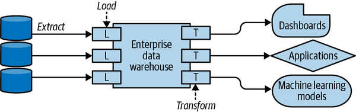
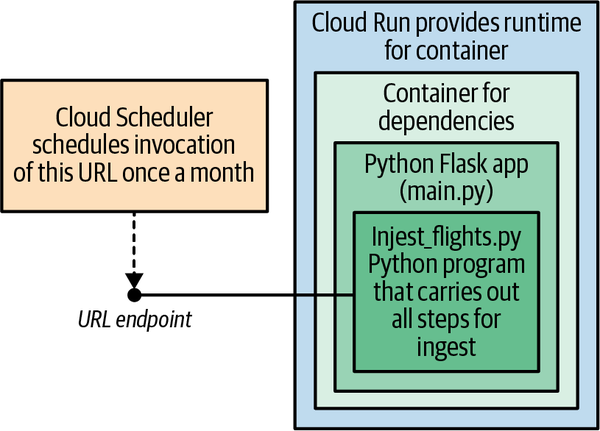
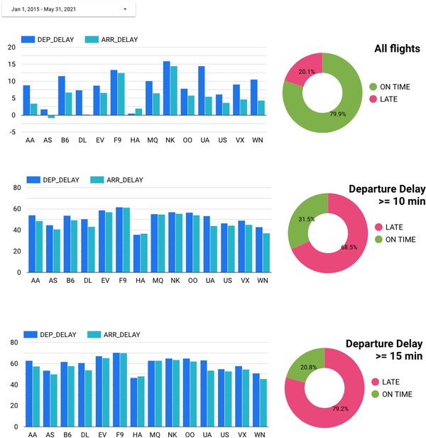

# de-zoomcamp-project

## Overview

This project explores the idea of deciding whether to cancel a meeting in a data-driven way. It introduces a probabilistic decision criterion to cancel the meeting with a client if the probability of the flight arriving within 15 minutes of the scheduled arrival time was less than 70%. 

## Dataset

The dataset that captures flight delays is called [Airline On-Time Performance Data](https://www.bts.gov/topics/airline-time-tables). It includes information such as the origin and destination airports, flight numbers, flight departure and arrival dates, and nonstop distance between the two airports. 

## Technologies

The following technologies have been utilized in the project:

- **Data Lake**: GCP Cloud Storage. 
- **Data Warehouse**: GCP BigQuery.
- **Infrastructure-as-Code (IaC)**: Terraform. 
- **Data Analysis & Exploration**: SQL.
- **Data Transformation**: Apache Spark (Batch processing).
- **Distributed Processing**: GCP Dataproc. 
- **Pipeline Orchestration**: GitHub Actions.
- **Containarization**: Docker (in Cloud Run).
- **Automation**: GCP Cloud Run and GCP Cloud Scheduler.
- **Visualisation**: GCP Data Studio.

## Architecture

### Hub-and-Spoke Architecture

 

### The architecture of the monthly ingest job 



## Dashboard




## Implementation Details

### Ingesting data onto the Data Lake (GCS) and Data Warehouse (GBQ)

#### Create a bucket using Terraform
* Start VM instance `de-zoomcamp`
* Log-in to VM instance using web-based SSH.
* Update the project files to get the Terraform files from the project GitHub repo: `git pull`
* Run the Terraform commands to create the GCP bucket for the project:
```
terraform init

# Check changes to new infra plan
terraform plan -var="project=de-zoomcamp-prj-375800"
# Create new infra
terraform apply -var="project=de-zoomcamp-prj-375800"
```

* Verify on the dashboard that the bucket has been created. 

#### Create a Deployment to automate the batch ingestion of the model training data with GitHub Actions

* In your GitHub repository, click on the Actions tab.

* Click on the New workflow button and select a template or create your own custom workflow.

* In the workflow file, you can define the events that trigger the workflow, such as a push or pull request to a specific branch.

* You can also define the jobs and steps that run when the workflow is triggered. For example, you can add a step to run your ingestion bash script.

* To run your bash script in a step, you can use the run keyword followed by the command to execute your script. For example:

```
- name: Run ingestion script
  run: |
    chmod +x ./ingest.sh
    ./ingest.sh
```

* Once you have defined your workflow, commit and push your changes to GitHub.

* You can use environment variables to parameterize your deployment in GitHub Actions. For example:

```
jobs:
  deploy:
    runs-on: ubuntu-latest
    env:
      FIRST_YEAR: 2015
      LAST_YEAR: 2018
      BUCKET: my_gcs_bucket
```

* In the step where you run your ingestion bash script, you can pass the values of these environment variables as arguments to your script. For example:

```
- name: Run ingestion script
  run: |
    chmod +x ./ingest.sh
    ./ingest.sh $FIRST_YEAR $LAST_YEAR $BUCKET
```

* To change the values of these parameters when the script is executed, you can update the values of the environment variables in your workflow file and commit and push your changes to GitHub.

* For GitHub Actions authentication into Google Cloud, use the recommended [Workload Identity Federation](https://github.com/google-github-actions/auth#authenticating-via-workload-identity-federation)

#### Deploy the monthly downloads for the model serving data with Cloud Run

* Go to the ingest/monthlyupdate folder in the repo.
* Make sure the `Dockerfile` and `requirements.txt` exist in the folder.
* Grant the service account the [sufficient privileges to build and submit Docker images](https://www.bing.com/search?q=GCP+service+account+permissions+for+building+containers+in+cloud+run&toWww=1&redig=BA7D00EC109D49368696CA7A800CBDF1).
* Deploy the Python Web service as a Docker container to Cloud Run using the command:

```
export NAME=ingest-flights-monthly
export SVC_ACCT=dtc-de-zoomcamp-srv-acc
export PROJECT_ID=$(gcloud config get-value project)
export REGION=australia-southeast1
export SVC_EMAIL=${SVC_ACCT}@${PROJECT_ID}.iam.gserviceaccount.com

gcloud run deploy $NAME --region $REGION --source=$(pwd) \
    --platform=managed --service-account ${SVC_EMAIL}  \
    --no-allow-unauthenticated --timeout 12m
```

#### Invoke the monthly downloads service on Cloud Run

* Invoke the deployed Web service on Cloud Run using the command:

```
NAME=ingest-flights-monthly
BUCKET=dsongcp_data_lake_de-zoomcamp-prj-375800
URL=$(gcloud run services describe ${NAME} --format 'value(status.url)')
echo $URL
# Ingest next month in last available year (2019)
echo {\"bucket\":\"${BUCKET}\"\} > /tmp/message
curl -k -X POST $URL \
   -H "Authorization: Bearer $(gcloud auth print-identity-token)" \
   -H "Content-Type:application/json" --data-binary @/tmp/message
```

#### Schedule the monthly downloads with Cloud Scheduler

* Invoke Cloud Run once a month to ingest the newly monthly data using the command:

```
SVC_ACCT=dtc-de-zoomcamp-srv-acc-102
PROJECT_ID=$(gcloud config get-value project)
SVC_EMAIL=${SVC_ACCT}@${PROJECT_ID}.iam.gserviceaccount.com
BUCKET=dsongcp_data_lake_de-zoomcamp-prj-375800
URL=$(gcloud run services describe ${NAME} --format 'value(status.url)')
echo {\"bucket\":\"${BUCKET}\"\} > /tmp/message
cat /tmp/message

gcloud scheduler jobs create http monthlyupdate \
       --description "Ingest flights using Cloud Run" \
       --schedule="8 of month 10:00" \
       --time-zone "America/New_York" \
       --uri=$URL --http-method POST \
       --oidc-service-account-email $SVC_EMAIL \   
       --oidc-token-audience=$URL \
       --max-backoff=7d \
       --max-retry-attempts=5 \
       --max-retry-duration=2d \
       --min-backoff=12h \
       --headers="Content-Type=application/json" \
       --message-body-from-file=/tmp/message
```

### Data Transformation: Bayes Classifier on Cloud Dataproc

#### Create Dataproc cluster
In CloudShell:
* Clone the repository if you haven't already done so:
    ```
    git clone https://github.com/anammari/de-zoomcamp-project.git
    ```
* Change to the transform directory:
    ```
    cd transform
    ```
* Create the Dataproc cluster to run jobs on, specifying the name of your bucket and a 
  zone in the region that the bucket is in.
   ```
    ./create_cluster.sh <BUCKET-NAME>  <COMPUTE-ZONE>
    ```
*Notes:* 

- Make sure that the compute zone is in the same region as the bucket, otherwise you will incur network egress charges.

- The `create_cluster.sh` bash script will perform the activities below:

    - Create the dataproc cluster.

    - Preinstall the required Python packages on all the dataproc cluster nodes. 

    - Download the GitHub repository containing the data transformation code on the the dataproc cluster Master node.

#### Transformations applied include:

    - Apply data quantization (e.g. putting each flight into one of several bins) of two numerical variables: the departure delay and the distance to be traveled. 
    
    - Build a statistical model (e.g. Bayesian classification) that uses the quantized version of the two variables, the departure delay and the distance to be traveled, to predict whether a flight will or will not encounter an arrival delay. 

    - Model evaluation using 2 validation datasets:
        - Rule-based out-of-sample dataset, generated using a boolean condition `is_train_day=FALSE`
        - Temporal-based out-of-sample dataset, generated using a random sample of the data in Year 2019, which was not used in training the model.  

* Navigate to the Dataproc section of the GCP web console and click on "Web Interfaces".

* Click on JupyterLab

* In JupyterLab, open transform/quantization.ipynb. Click Run | Clear All Outputs. Then run the cells one by one.
 
* [optional] make the changes suggested in the notebook to run on the full dataset.  Note that you might have to reduce numbers to fit into your quota.

#### Productionization: Serverless Spark

* Copy the PySpark script on Cloud Storage:

```
gsutil cp bayes_on_spark.py gs://$BUCKET/
```

* Submit the Dataproc job using gcloud:

```
gcloud beta dataproc batches submit pyspark \
   --project=$(gcloud config get-value project) \
   --region=$REGION \
   gs://${BUCKET}/bayes_on_spark.py \
   -- \
   --bucket ${BUCKET} --debug
```
  
#### Delete the cluster
* Delete the cluster either from the GCP web console or by typing in CloudShell, ```./delete_cluster.sh <YOUR REGION>```
